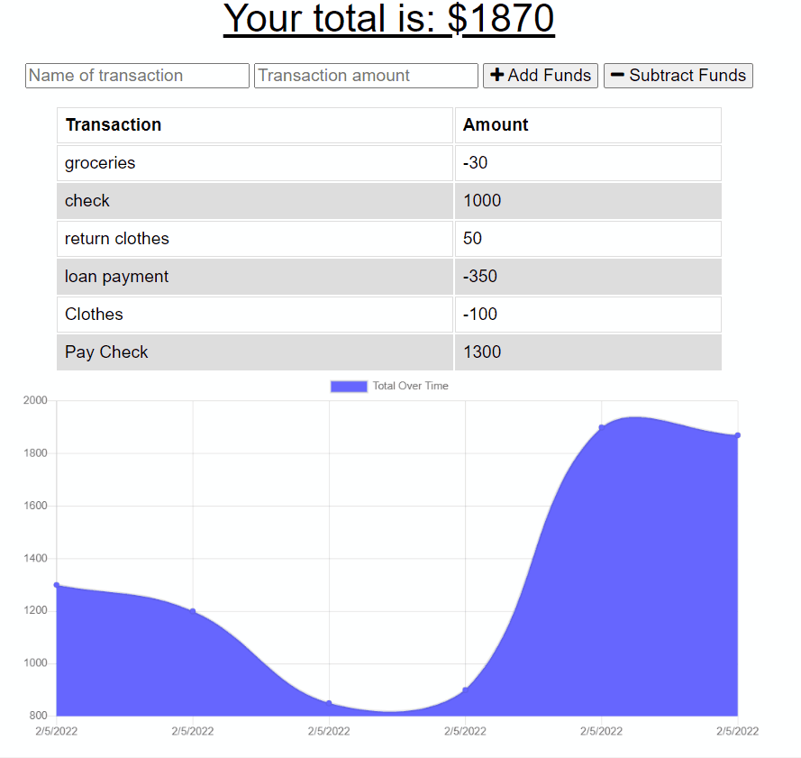
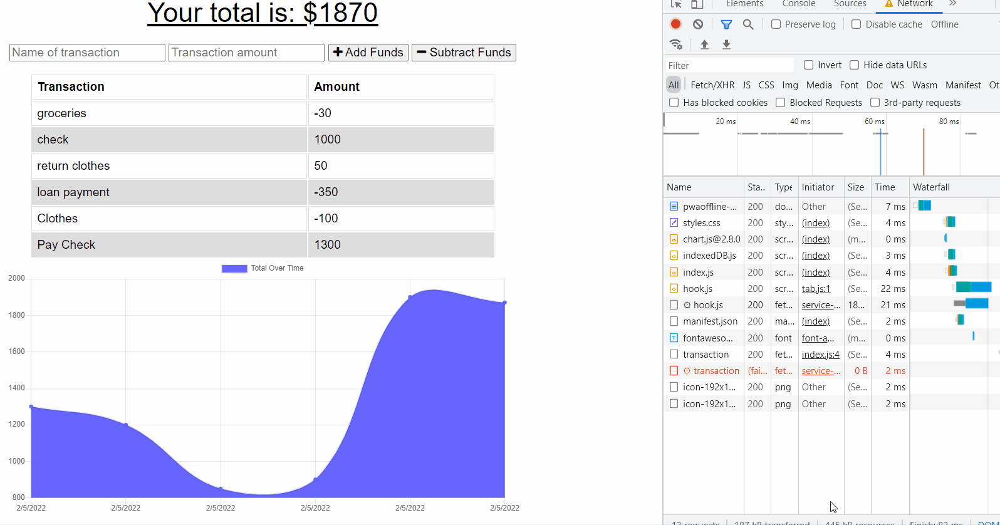

# Offline Budget Tracker

Overview:  

For this project functionality was added to an existing Budget Tracker application to allow a fast and easy way to track their money at all times.  Adding offline access which allowes a user to be able to add expenses and deposits to their budget with or without a connection. When entering transactions offline, they populate the total when brought back online.

# Links

### Website link 
https://pwaoffline-budget-tracker.herokuapp.com/

### GitHub Link
https://github.com/lindamart/offline_budget_tracker

# Table of Contents 

- [Preview](#preview)

- [Build Criteria](#build-criteria) 

- [Contact Me](#contact-me)

- [Credits](#credits)

- [License](#license)

# Preview
### Add a workout

- Ability to add and subtract funds while Online

- Ability to add and subtract funds while Offline and see them when back online

# Build Criteria

- WHEN the user inputs a withdrawal or deposit THEN that will be shown on the page, and added to their transaction history when their connection is back online.

- The transaction history should be replayed in order.

- The history should be kept in either IndexDB or browser cache.

- If the server is up, the current transactions should still be sent to the server without being added to the failure cache.

- The initial list of cache_files should include all static assets.

# Contact Me

Contact me with any questions.

Linda Martinez [lindanmjw@gmail.com](mailto:lindanmjw@gmail.com)

# Credits 

MongoDB: https://docs.atlas.mongodb.com/

Mongoose: https://mongoosejs.com/

MDN: https://developer.mozilla.org/en-US

Heroku: https://dashboard.heroku.com/apps

# License

The MIT License (MIT)

Copyright (c) 2022 Linda Martinez

Permission is hereby granted, free of charge, to any person obtaining a copy of this software and associated documentation files (the "Software"), to deal in the Software without restriction, including without limitation the rights to use, copy, modify, merge, publish, distribute, sublicense, and/or sell copies of the Software, and to permit persons to whom the Software is furnished to do so, subject to the following conditions:

The above copyright notice and this permission notice shall be included in all copies or substantial portions of the Software.

THE SOFTWARE IS PROVIDED "AS IS", WITHOUT WARRANTY OF ANY KIND, EXPRESS OR IMPLIED, INCLUDING BUT NOT LIMITED TO THE WARRANTIES OF MERCHANTABILITY, FITNESS FOR A PARTICULAR PURPOSE AND NONINFRINGEMENT. IN NO EVENT SHALL THE AUTHORS OR COPYRIGHT HOLDERS BE LIABLE FOR ANY CLAIM, DAMAGES OR OTHER LIABILITY, WHETHER IN AN ACTION OF CONTRACT, TORT OR OTHERWISE, ARISING FROM, OUT OF OR IN CONNECTION WITH THE SOFTWARE OR THE USE OR OTHER DEALINGS IN THE SOFTWARE.
  